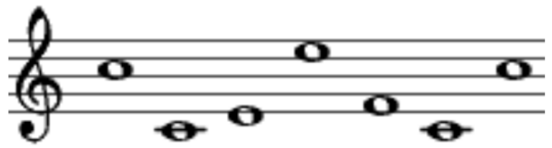
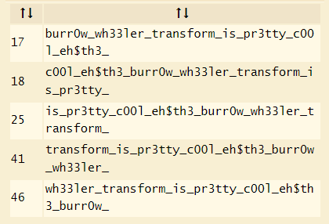

# **Repeat**
- Đây bản chất là một bài XOR bình thường. Ta có `gen.py` code như sau:
```py
import os
import secrets

flag = "REDACATED"
xor_key = secrets.token_bytes(8)

def xor(message, key):
    return bytes([message[i] ^ key[i % len(key)] for i in range(len(message))])

encrypted_flag = xor(flag.encode(), xor_key).hex()

with open("flag.enc", "w") as f:
    f.write("Flag: "+encrypted_flag)
```
- ***Key*** của thuật toán là một list gồm ***8 byte ngẫu nhiên***, và việc này khá khó để brute được. Hàm `xor` đơn giản là thực hiện ***XOR từng ký tự*** của flag với ***từng byte một của khóa*** và thực hiện ***quay vòng***, tức đến byte cuối của khóa thì sẽ thực hiện lại từ byte đầu. Các ký tự được XOR sẽ được lưu vào mảng và chuyển cả mảng về dạng `byte`. Sau khi chuyển về `byte` xong thì encrypted flag được tiếp tục chuyển về `hex`, và được lưu vào trong file `flag.enc`
- Encrypted flag trong file:
```
Flag: 982a9290d6d4bf88957586bbdcda8681de33c796c691bb9fde1a83d582c886988375838aead0e8c7dc2bc3d7cd97a4
```
- Như vậy, với kết quả encrypted flag cuối cùng, ta hoàn toàn có thể tìm được key dựa vào syntax của flag. Syntax flag là `UoftCTF{...}` nhưng khi em thử thì không ra, nên syntax trong bài này là `uoftctf{...}`. Ta có thể hiểu như sau:
    * `u` ⊕ &lt;byte 1 của khóa> sau khi chuyển sang hex được giá trị `98`
    * `o` ⊕ &lt;byte 2 của khóa> sau khi chuyển sang hex được giá trị `2a`
    * ...
    * `{` ⊕ &lt;byte 8 của khóa> sau khi chuyển sang hex được giá trị `88`
- Dựa vào tính chất của phép XOR `a ⊕ a = 0` và `a ⊕ 0 = a`, nếu ta có plaintext là `m` và khóa là `k`, ta sẽ có ciphertext là `c = m ⊕ k`. Từ `c` và `m` ta thực hiện ngược lại để ra `k` như sau: `c ⊕ m = m ⊕ k ⊕ m = k ⊕ 0 = k`
- Như vậy, ta có đoạn file `dec.py` như sau:
    ```py
    from pwn import *

    f = bytes.fromhex(open("flag.enc", "r").read().split(" ")[1])
    key = xor(b'uoftctf{', f[0:8])
    flag = bytes([f[i] ^ key[i % 8] for i in range(len(f))])
    print(flag.decode())
    ```
    * Đầu tiên, ta đọc file, lấy phần chuỗi đằng sau sau dấu `" "`, và đây là dạng hex nên ta chuyển về byte bằng `bytes.fromhex()`
    * Ta thực hiện XOR từng byte của chuỗi `uoftctf{` với 8 byte đầu của encrypted flag bởi hàm `xor` trong module `pwn`
    * Sau đó ta chỉ cần thực hiện xor từng byte của encrypted_flag với key để được chuỗi ban đầu
- Flag: `uoftctf{x0r_iz_r3v3rs1bl3_w17h_kn0wn_p141n73x7}`

# **Pianoman**
- Đây là đề RSA bình thường với `p` và `q` cho trước nhưng bị ẩn đi `e`. Đây là file `music_cipher.py`:
```py
# no secrets for you!
flag = ...

# Prime numbers
p = 151974537061323957822386073908385085419559026351164685426097479266890291010147521691623222013307654711435195917538910433499461592808140930995554881397135856676650008657702221890681556382541341154333619026995004346614954741516470916984007797447848200982844325683748644670322174197570545222141895743221967042369
q = 174984645401233071825665708002522121612485226530706132712010887487642973021704769474826989160974464933559818767568944237124745165979610355867977190192654030573049063822083356316183080709550520634370714336131664619311165756257899116089875225537979520325826655873483634761961805768588413832262117172840398661229
n = p * q

# a public exponent hidden away by Windy's musical talents
e = ...


# Converting the message to an integer
m = int.from_bytes(message.encode(), 'big')

# Encrypting the message: c = m^e mod n
inc_m = pow(message_int, e, n)

print(encrypted_message_int)

```

- Theo như miêu tả trong comment file code, giá trị của `e` được ẩn bởi ảnh sau:
<p align="center">
    
</p>

- Dựa vào [dcode.fr](https://www.dcode.fr/music-sheet-cipher), ta tìm được giá trị của `e = 7029307`
- Như vậy, ta đã có đầy đủ các giá trị cần tìm, giờ chỉ cần convert lại encrypted flag thành flag. Ta có file `dec.py` sau:
```py
from Crypto.Util.number import long_to_bytes, inverse

c = int(open("output.txt", "r").read())
e = 7029307
p = 151974537061323957822386073908385085419559026351164685426097479266890291010147521691623222013307654711435195917538910433499461592808140930995554881397135856676650008657702221890681556382541341154333619026995004346614954741516470916984007797447848200982844325683748644670322174197570545222141895743221967042369
q = 174984645401233071825665708002522121612485226530706132712010887487642973021704769474826989160974464933559818767568944237124745165979610355867977190192654030573049063822083356316183080709550520634370714336131664619311165756257899116089875225537979520325826655873483634761961805768588413832262117172840398661229
n = p * q
phi = (p-1)*(q-1)
d = pow(e,-1,phi)
m = pow(c,d,n)
print(long_to_bytes(m))
```
- Flag: `uoftctf{AT1d2jMCVs03xxalViU9zTyiiV1INNJY}`

# **Wheel Barrow**
- Đề chỉ cho file encrypted flag như sau:
```
hc0rhh3r3ylmsrwr___lsewt_03raf_rpetouin$_3tb0_t
```
- Dựa vào tên của bài, ta tìm được `Burrows–Wheeler Transform` trên [dcode.fr](https://www.dcode.fr/burrows-wheeler-transform). Ném encrypted flag vào đó và ta được những kết quả sau:
<p align="center">
    
</p>

- Dựa vào một chút tiếng Anh, ta chọn cái đầu tiên, nhưng đổi lại vị trí một chút là được flag. Hoặc có thể hiểu ký tự `$` là ký tự kết thúc chuỗi (trong Assembly) nên nó phải nằm ở cuối
- Flag: `th3_burr0w_wh33ler_transform_is_pr3tty_c00l_eh$`